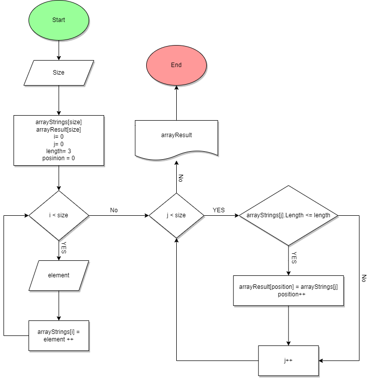

# **Задача**

## Итоговая проверочная работа

Данная работа необходима для проверки ваших знаний и навыков по итогу прохождения первого блока обучения на программе Разработчик. Мы должны убедится, что базовое знакомство с IT прошло успешно.

Задача алгоритмически не самая сложная, однако для полноценного выполнения проверочной работы необходимо:

1. Создать репозиторий на *GitHub*
2. Нарисовать блок-схему алгоритма (можно обойтись блок-схемой основной содержательной части, если вы выделяете её в отдельный метод)
3. Снабдить репозиторий оформленным текстовым описанием решения (файл *README.md*)
4. Написать программу, решающую поставленную задачу
5. Использовать контроль версий в работе над этим небольшим проектом (не должно быть так, что всё залито одним коммитом, как минимум этапы 2, 3, и 4 должны быть расположены в разных коммитах)

Задача: Написать программу, которая из имеющегося массива строк формирует новый массив из строк, длина которых меньше, либо равна 3 символам. Первоначальный массив можно ввести с клавиатуры, либо задать на старте выполнения алгоритма. При решении не рекомендуется пользоваться коллекциями, лучше обойтись исключительно массивами.

Примеры:
[“Hello”, “2”, “world”, “:-)”] → [“2”, “:-)”]

[“1234”, “1567”, “-2”, “computer science”] → [“-2”]

[“Russia”, “Denmark”, “Kazan”] → []

# Описание решения

1. Создать репозиторий на GitHub
https://github.com/Alessio32r/FinalTest

2. Нарисовать блок-схему алгоритма

3. Снабдить репозиторий оформленным текстовым описанием решения (файл README.md)

    **Вы сейчас в нём**

4. Написать программу, решающую поставленную задачу
 https://github.com/Alessio32r/FinalTest/blob/main/Program.cs

**Описание алгоритма решения задачи**

    Пользователь указывает сколько элементов (*element*) он хочет задать и заполняет массив вручную поэлементно в цикле n-раз (*size*).
    Далее проходим по изначальному массиву циклом и проверяем, проверяем выполняется ли условик что "длина символов (*length*) <= 3". Если элемент подходит под данное условие, то мы добавляем его в новый массив, используя при этом дополнительный счетчик (*position*), чтобы элементы в новом массиве заполнялись последовательно (без пропусков).
    Печатаем массив через пробел методом *PrintArray*.
